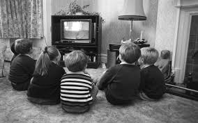
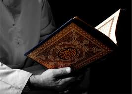
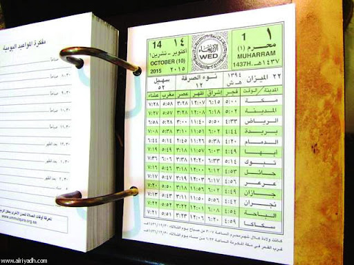

 <h1>المسابقه رقم ١</h1> 

* * *

 

الثيم لهالمسابقه: افلام الكرتون القديمة 
 
طريقة المسابقة:
<ul>
  <li>تسمع ل٥ -١٠ ثواني من مقطع صوتي من فلم كرتون قديم</li>
  <li>تكتب توقعك للاجابه في المكان المحدد</li>
  <li>بعد ما تخلصون، تضغطون على زر "الاجابه".ا</li>
  <li>راح تبان الاجابات</li>
  <li>صحح لنفسك (بدون غش) ا&#x1F612;</li>
  <li>و اضغط على زر "احسب نتيجتك"ا</li>
</ul> 

 
بعضها سهل و بعضها صعب. خلونا نشوف شطارتكم  
فيصل اتحداك &#x1F60E;  
<a href="./quiz1.html">رابط المسابقه</a>

 

 <h1>المسابقه رقم ٢</h1> 

 

 

 

الثيم لهالمسابقه: قراء القرآن الكريم
 
طريقة المسابقة:
<ul>
  <li>تسمع لمقطع قصير لقارئ معروف</li>
  <li>اختر توقعك من الخيارات المحدده</li>
  <li>بعد اكمال الخيارات اضغط على زر "احسب نتيجتك" لحساب نتيجتك النهائيه</li>
</ul> 

 
هالمره خليتها خيارات عشان تكون اسهل بعد ما شفت نتايج المسابقه الاولى&#x1F605; 
بس هالمره فيه وقت محدد لاكمال الاجابات
 
عدد الاسئله ١٠ و الوقت ٨ دقايق
 
لتخفيف الضغط: ما اتحداك فيصل  
<a href="./quiz2.html">رابط المسابقه</a>

 

 

 <h1>المسابقه رقم ٣</h1> 

 

 

 

الثيم لهالمسابقه: احداث مهمه بتاريخ السعودية
 
طريقة المسابقة:
<ul>
  <li>صوره لحدث مهم بتاريخ السعوديه مع ذكر الحدث</li>
  <li>اختر توقعك من الخيارات المحدده لسنة وقوع الحدث</li>
  <li>بعد اكمال الخيارات اضغط على زر "احسب نتيجتك" لحساب نتيجتك النهائيه</li>
</ul> 

 
عدد الاسئله ١٥ و الوقت ٥ دقايق
 
<a href="./quiz3.html">رابط المسابقه</a>

 

 <h1>المسابقه رقم ٤</h1> 

 

 

 

الثيم لهالمسابقه: اخوكم الصغير
 
طريقة المسابقة:
<ul>
  <li>اسئله عني 😎</li>
  <li>اختر توقعك من الخيارات المحدده</li>
  <li>بعد اكمال الخيارات اضغط على زر "احسب نتيجتك" لحساب نتيجتك النهائيه</li>
</ul> 

 
عدد الاسئله ١٥ و الوقت ١٠ دقايق
 
<a href="./quiz4.html">رابط المسابقه</a>

 

 

 <h1>المسابقه رقم ٥</h1> 

 

 

Coming soon ...

